# Azure OpenAI Service の GPT-Image-1 & Sora を使った画像 & 動画生成手順

## 0. 事前準備

- Azure サブスクリプション
- GPT-Image-1 利用申請の承認
  - Azure OpenAI Service の GPT-Image-1 を利用するには、Azure サブスクリプションのほかに、予め利用申請が必要です。[利用申請](https://aka.ms/oai/gptimage1access) から予め申請を行ってください。(Sora は不要です)

## 1. Azure OpenAI Service および GPT-Image-1 & Sora の利用準備

- [Azure AI Foundry (ポータル)](https://ai.azure.com) にサインインし、Azure サブスクリプションが使えるアカウントでサインインします。
  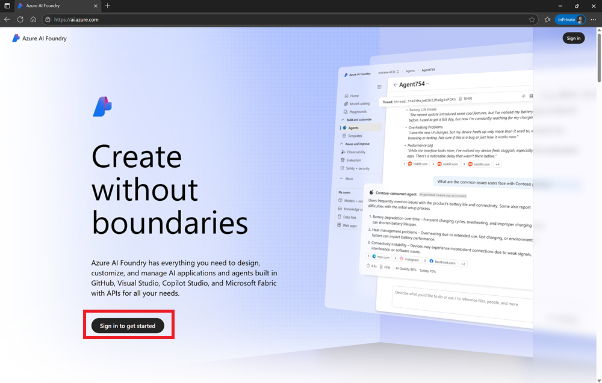

### Azure AI Foundry プロジェクトの作成

- Azure AI Foundry の **[+新規作成]** から新規プロジェクトを作成します。
  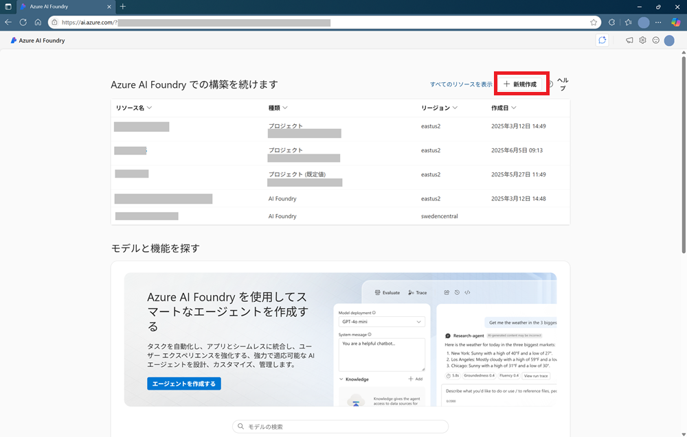

- AI Foundry プロジェクトを選択して作成します。
  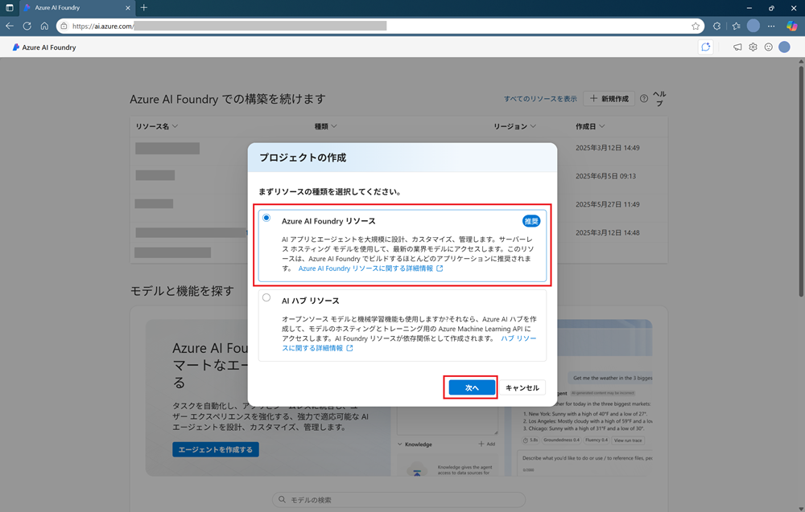

- **プロジェクト名** を指定します。(リソースグループ、AI Foundry リソース(名) は適時お好みに合わせて修正します。) リージョンを選択し、**[作成する]** をクリックして、プロジェクト一式を作成します。完了すると作成したプロジェクトの詳細が表示されます。
  - GPT-Image-1 は **West US 3** など, Sora は **East US 2** などにありますので、リージョンはどちらかを選択すると良いでしょう。 (今回は迷ったら East US 2 を選んでください)
  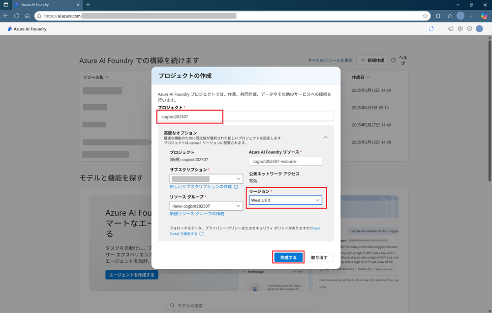

### GPT-Image-1 & Sora モデルのデプロイ

- 左バナーから **モデル + エンドポイント** をクリックします。
  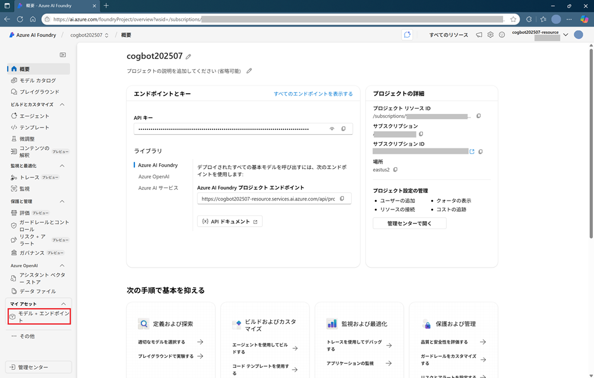

- **モデルのデプロイ** をクリックしてから **基本モデルをクリックする** をクリックして、モデルをデプロイしていきます。
  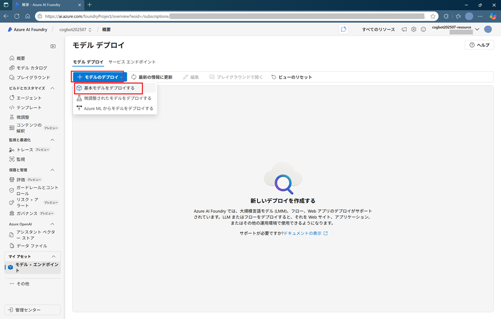

- 検索欄に **gpt-image-1** と入力して検索、GPT-Image-1 が表示されたら選択し、**[確認]** をクリックします。
  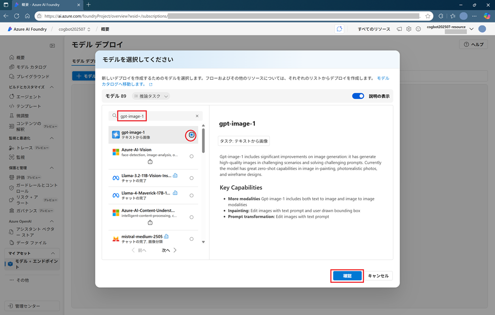

- **[接続とデプロイ]** をクリックして、モデルをデプロイします。
  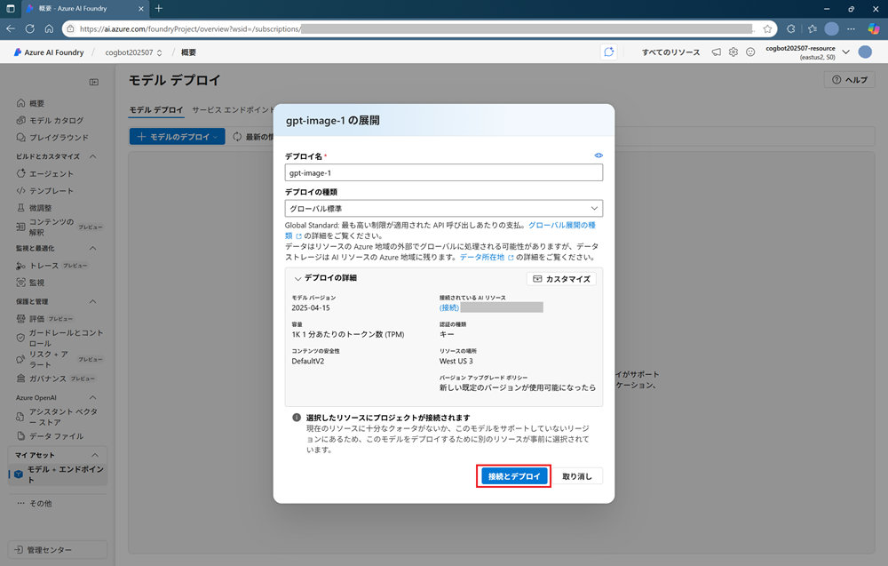

- デプロイが完了すると、モデルの利用方法が表示されます。**エンドポイント** に表示されている **ターゲットURL** と **キー** を取得して、ローカルに保存するなどしておきます。これらを使って RestAPI で操作できます。
  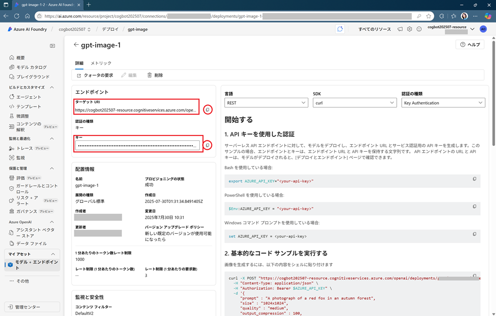

- 同様に **Sora** をデプロイします。

## 2. GPT-Image-1 の呼び出し

### Azure AI Foundry での操作

- [Azure AI Foundry (ポータル)](https://ai.azure.com) で左バナーから **プレイグラウンド** をクリックし、表示される **画像プレイグラウンド** をクリックします。
  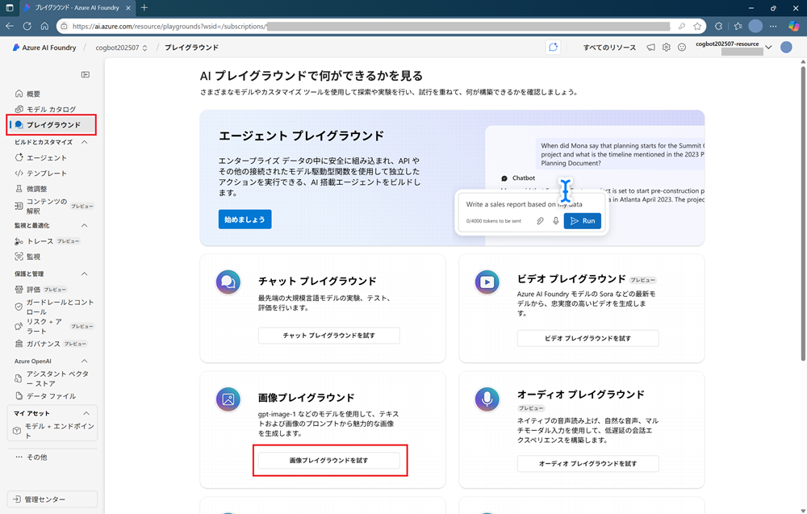

- **画像プレイグラウンド** が表示されます。デプロイに **gpt-image-1** が表示されているのを確認して、画面下部の入力欄にプロンプト(生成したい画像の説明)を入力し、**[生成]** をクリックすると、画像が生成されます。
  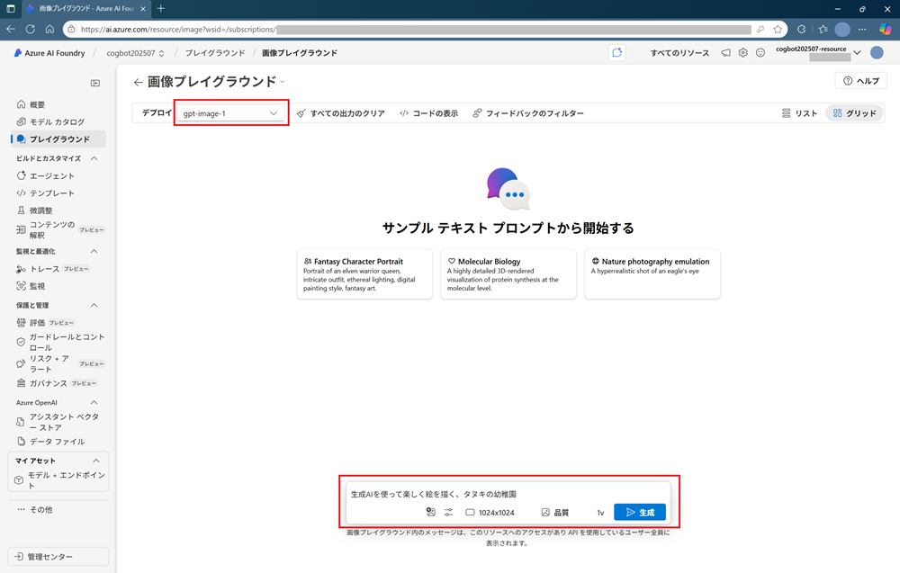

- 生成した画像の右上の **(…)** をクリックすると、ダウンロードやプロンプトを編集して再生成するなどの操作ができます。
  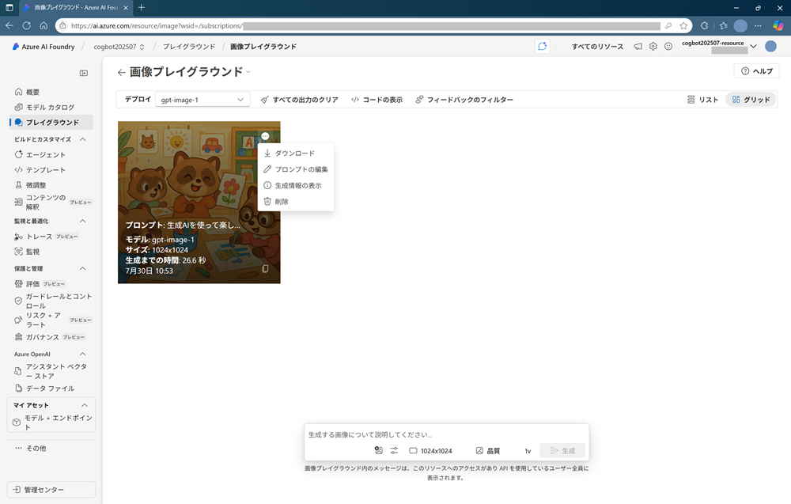


### API での操作

### Rest API

```http
POST https://<your-resource-name>.openai.azure.com/openai/deployments/gpt-image-1/images/generations?api-version=2025-04-01-preview
api-key: <your-api-key>
Content-Type: application/json

{
  "prompt": "富士山と桜の美しい風景を描いてください。",
  "n": 1,
  "size": "1024x1024",
  "quality": "medium",
  "output_format": "png"
}
```

### Python

```python
import requests

endpoint = "https://<your-resource-name>.openai.azure.com/openai/deployments/gpt-image-1/images/generations?api-version=2025-04-01-preview"
api_key = "<your-api-key>"

headers = {
    "api-key": api_key,
    "Content-Type": "application/json"
}

data = {
    "prompt": "富士山と桜の美しい風景を描いてください。",
    "n": 1,
  "size": "1024x1024",
  "quality": "medium",
  "output_format": "png"
}

response = requests.post(endpoint, headers=headers, json=data)
for idx, item in enumerate(response['data']):
  b64_img = item['b64_json']
  filename = f"{image_{idx+1}.png"
  decode_and_save_image(b64_img, filename)
  print(f"画像は次に保存されました: '{filename}'")
```


## 3. Sora の呼び出し

### Azure AI Foundry での操作

- [Azure AI Foundry (ポータル)](https://ai.azure.com) で左バナーから **プレイグラウンド** をクリックし、表示される **ビデオプレイグラウンド** をクリックします。

- **ビデオプレイグラウンド** が表示されます。デプロイに **sora** が表示されているのを確認して、画面下部の入力欄にプロンプト(生成したい動画の説明)を入力し、**[生成]** をクリックすると、画像が生成されます。
  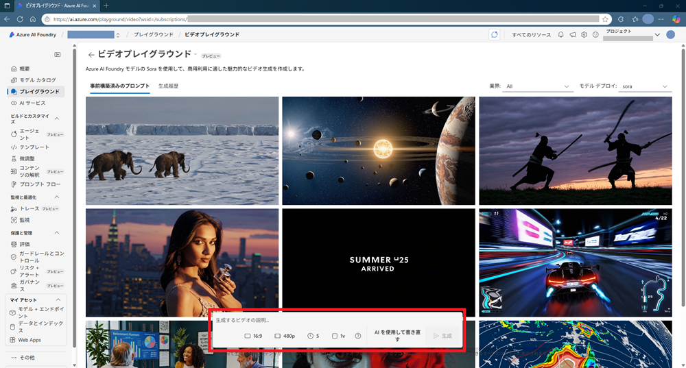


## 参考ドキュメント (Microsoft Learn)

- 画像生成 (GPT-Image-1)
  - [AI を使用して画像を生成する](https://learn.microsoft.com/ja-jp/training/modules/generate-images-azure-openai/)
  - [クイック スタート: Azure AI Foundry モデルで Azure OpenAI を使用してイメージを生成する](https://learn.microsoft.com/ja-jp/azure/ai-foundry/openai/dall-e-quickstart)
  - [Azure OpenAI イメージ生成モデルを使用する方法](https://learn.microsoft.com/ja-jp/azure/ai-foundry/openai/how-to/dall-e?tabs=gpt-image-1)
  - [Azure AI Foundry における Azure OpenAI モデル- 画像生成モデル](https://learn.microsoft.com/ja-jp/azure/ai-foundry/openai/concepts/models?tabs=global-standard%2Cstandard-chat-completions#image-generation-models)
- 動画生成 (Sora)
  - [Sora ビデオ生成](https://learn.microsoft.com/ja-jp/azure/ai-foundry/openai/concepts/video-generation)
  - [クイック スタート: Soraを使用してビデオを生成する (プレビュー)](https://learn.microsoft.com/ja-jp/azure/ai-foundry/openai/video-generation-quickstart)
  - [Soraで不可能な2D/3Dモーションテクニックをアニメーション化する](https://learn.microsoft.com/ja-jp/training/modules/animate-impossible/)